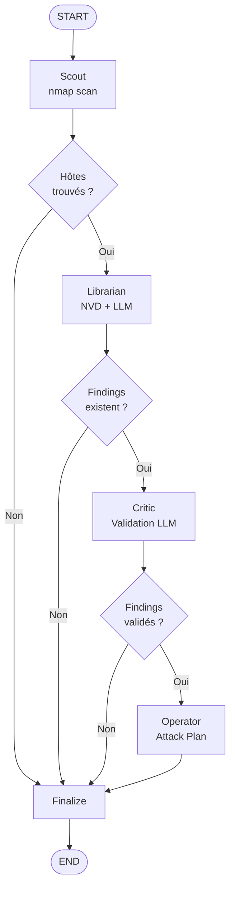

# Architecture — RAO-Framework

## Vue d'ensemble

RAO-Framework est un pipeline d'agents orchestrés via **LangGraph**. Chaque agent est autonome, s'exécute dans son propre nœud du graphe, et passe l'état de la mission (`MissionState`) au suivant.

```
┌─────────────────────────────────────────────────────────────────┐
│                         CLI / Python API                        │
│              rao scan | rao recon | rao webscan ...             │
└─────────────────────┬───────────────────────────────────────────┘
                      │
                      ▼
┌─────────────────────────────────────────────────────────────────┐
│                    OCC (Operational Command Center)             │
│                        LangGraph StateGraph                     │
│                                                                 │
│   ┌─────────┐   ┌───────────┐   ┌────────┐   ┌──────────┐     │
│   │  Scout  │──▶│ Librarian │──▶│ Critic │──▶│ Operator │     │
│   └─────────┘   └───────────┘   └────────┘   └──────────┘     │
│        │               │              │             │           │
│        ▼               ▼              ▼             ▼           │
│   [HostInfo]     [Finding[]]   [validated_  [attack_plan]      │
│                               findings[]]                       │
└─────────────────────────────────────────────────────────────────┘
                      │
          ┌───────────┼──────────────┐
          ▼           ▼              ▼
     WebScanner  SubdomainEnum  ReportGenerator
         │              │             │
         ▼              ▼             ▼
    [WebScanResult] [subdomains]  [JSON + HTML]
```

---

## Composants

### `MissionState` — État partagé

Objet de données qui circule à travers tout le pipeline. Défini dans `rao/core/state.py`.

```python
@dataclass
class MissionState:
    target: str                          # IP ou domaine cible
    scope: list[str]                     # CIDRs/IPs/domaines autorisés
    hosts: list[HostInfo]                # Hôtes découverts par le Scout
    findings: list[Finding]              # Findings bruts du Librarian
    validated_findings: list[Finding]    # Findings validés par le Critic
    web_scans: list[WebScanInfo]         # Résultats web scanner
    subdomains: list[SubdomainInfo]      # Sous-domaines énumérés
    current_phase: str                   # Phase courante du pipeline
    errors: list[str]                    # Erreurs non-fatales
    attack_plan: str                     # Plan d'attaque généré par l'Operator
```

---

### Agents

#### Scout — Reconnaissance

**Fichier :** `rao/agents/scout.py`

Effectue le scan nmap sur toutes les cibles dans le scope. Utilise `NmapScanner` (wrapper python-nmap) avec les arguments `-sV -sC --top-ports 1000`.

- Détection de services et versions
- OS fingerprinting
- Initialisation lazy de nmap (erreur claire si non installé)
- Résultat : peuple `mission.hosts` avec `HostInfo` et `PortInfo`

#### Librarian — Corrélation CVE

**Fichier :** `rao/agents/librarian.py`

Pour chaque service découvert, interroge la NVD (National Vulnerability Database) et utilise le LLM pour évaluer la pertinence des CVEs.

- Requête NVD via `CVELookup`
- Sanitisation des descriptions CVE avant injection dans le prompt (protection prompt injection)
- Analyse LLM avec prompt structuré
- Fallback déterministe si LLM indisponible
- Résultat : peuple `mission.findings` avec des `Finding`

#### Critic — Validation

**Fichier :** `rao/agents/critic.py`

Passe chaque finding au LLM pour distinguer vrais positifs de faux positifs.

- Prompt demandant `VERDICT`, `EXPLOITABILITY`, `REASONING`, `VERIFICATION`
- Fallback offline : garde uniquement les findings CRITICAL/HIGH sans LLM
- Réinitialise le cache LLM en cas d'erreur (gestion expiration de token)
- Résultat : peuple `mission.validated_findings`

#### Operator — Planification

**Fichier :** `rao/agents/operator.py`

Génère un plan d'attaque textuel basé sur les findings validés. Résultat stocké dans `mission.attack_plan`.

---

### OCC — Orchestrateur

**Fichier :** `rao/core/orchestrator.py`

Construit et exécute le graphe LangGraph. Le routage est conditionnel :

```
Scout ──┬──(hosts trouvés)──▶ Librarian ──┬──(findings)──▶ Critic ──┬──(validés)──▶ Operator
        │                                  │                          │
        └──(aucun hôte)──▶ finalize        └──▶ finalize             └──▶ finalize
```

---

### Outils

| Outil | Fichier | Description |
|---|---|---|
| `NmapScanner` | `rao/tools/nmap_wrapper.py` | Wrapper python-nmap |
| `CVELookup` | `rao/tools/cve_lookup.py` | Requêtes NVD API v2 |
| `CVECache` | `rao/tools/cve_cache.py` | Cache local SQLite des CVEs |
| `WebScanner` | `rao/tools/web_scanner.py` | Scan HTTP headers, paths, CORS, cookies |
| `ScopeValidator` | `rao/tools/scope_validator.py` | Validation des cibles autorisées |
| `SubdomainEnumerator` | `rao/tools/subdomain_enum.py` | crt.sh + brute-force DNS |
| `KnowledgeBase` | `rao/knowledge/chroma_store.py` | Recherche vectorielle ChromaDB |
| `ToolRegistry` | `rao/tools/plugin.py` | Registre de plugins community |

---

### Reporting

| Module | Fichier | Sortie |
|---|---|---|
| `generate_report` | `rao/reporting/report_generator.py` | Console (Rich) + JSON |
| `generate_html_report` | `rao/reporting/html_report.py` | HTML dark-theme |

---

## Graphe LangGraph — Diagramme complet



---

## Structure des packages

```
rao/
├── __init__.py
├── cli.py                  # Interface Click (5 commandes)
├── config.py               # Settings Pydantic depuis .env
├── agents/
│   ├── scout.py            # Reconnaissance nmap
│   ├── librarian.py        # Corrélation CVE + LLM
│   ├── critic.py           # Validation + FP filtering
│   └── operator.py         # Attack plan generation
├── core/
│   ├── state.py            # MissionState, HostInfo, Finding...
│   ├── orchestrator.py     # OCC LangGraph
│   ├── llm.py              # Factory LLM (Groq/Ollama)
│   ├── session.py          # Save/load sessions JSON
│   └── structured_output.py # Pydantic models pour parsing LLM
├── tools/
│   ├── nmap_wrapper.py
│   ├── cve_lookup.py
│   ├── cve_cache.py
│   ├── web_scanner.py
│   ├── scope_validator.py
│   ├── subdomain_enum.py
│   └── plugin.py           # Protocole ToolPlugin + ToolRegistry
├── knowledge/
│   └── chroma_store.py     # KnowledgeBase ChromaDB
└── reporting/
    ├── report_generator.py
    └── html_report.py
```
